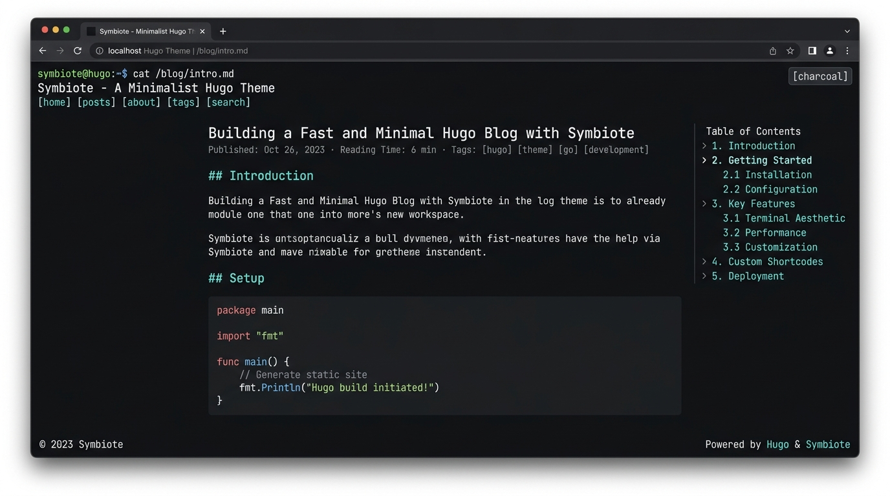

# Hugo Theme Symbiote



A dark, minimalistic, terminal-inspired Hugo theme built for security researchers and hackers.

## Features
- Fully responsive terminal UI
- Dynamic blinking prompt that reacts to page navigation
- Built-in `curl` hint for terminal access
- Hugo Pipes integration for heavily optimized CSS
- Robust internationalization (i18n) support
- Dynamic, extensible colour schemes

## Terminal UI Features

**Dynamic Blinking Prompt**
The header features a typing animation that simulates a terminal prompt. The command dynamically changes based on the page you are viewing (e.g., `cd ~` for the homepage, `ls -la /blog/` for lists, and `cat /blog/post.md` for articles).

You can customize the prompt identity in your `hugo.toml`:
```toml
[params]
  promptUser = "peter.p"
  promptHost = "oscorp"
  showCursor = true
```

**Curl Support**
The footer of every page includes a convenient hint (`curl -sL <url>`), encouraging visitors to fetch the raw plaintext content of the page directly from their terminal.

## Installation

Inside your Hugo project, add the theme as a submodule:
```bash
git submodule add https://github.com/br0wnboi/hugo-theme-symbiote.git themes/hugo-theme-symbiote
```

Then, add this to your `hugo.toml`:
```toml
theme = "hugo-theme-symbiote"
```

## Creating Custom Colour Schemes

This theme allows you to create custom colour schemes that automatically hook into the Javascript theme-switcher.

1. Create a `static/css/custom.css` (or `assets/css/custom.css`) in your project.
2. Define the strict 9-variable CSS API under a `:root[data-theme="your-theme-name"]` selector:
```css
:root[data-theme="your-theme-name"] {
    --bg:          #000000;
    --bg-surface:  #111111;
    --bg-elevated: #222222;
    --text:        #dddddd;
    --text-dim:    #888888;
    --text-bright: #ffffff;
    --accent:      #ff0000;
    --accent-dim:  #aa0000;
    --border:      #333333;
}
```
3. Update your `hugo.toml` to tell the theme-switcher about it:
```toml
[params]
  themes = ["your-theme-name", "venom", "charcoal"]
```

## Restricting or Removing Colour Schemes

To switch colour schemes, click the theme button in the top right corner of the header. The button displays the **current active theme** (e.g., `[charcoal]`) and updates dynamically as you cycle through the options.

If you only want specific colour schemes to show up on your website (e.g., you only want to cycle between `amoled` and `venom`), you do not need to delete any CSS.

Simply restrict the `themes` array in your `hugo.toml`:
```toml
[params]
  themes = ["amoled", "venom"]
```
The Javascript toggle will instantly respect this list and ignore all other built-in colour schemes.
